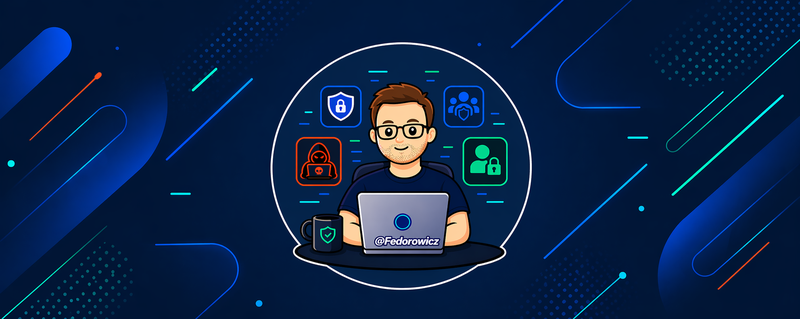

 
    

<h1 align="center">Hi, I'm Eduardo Fedorowicz 👋</h1>

  <b>Executivo de Segurança da Informação | Cibersegurança</b> 

  
  
  

---

## 🔐 Sobre Mim

Executivo de Segurança da Informação na **Globo**, com mais de **20 anos de experiência** em Segurança da Informação, atuando na definição, implementação e evolução de estratégias de proteção, resiliência cibernética e gestão de riscos em ambientes complexos, críticos e altamente expostos ao negócio.

Lidero as frentes de **Segurança de Infraestrutura e Plataformas**, **Segurança Ofensiva (Red Team)**, **Segurança de Workplaces** e **Gestão de Identidade e Acesso (IAM)**, conectando cenários técnicos complexos a decisões estratégicas e de negócio.

Já liderei iniciativas de **Defesa Cibernética (Blue Team)**, **Resposta a Incidentes (CSIRT)**, **Inteligência Contra Ameaças (CTI)** e **Quantificação de Risco Cibernético (CRQ)** — apoiando a priorização de riscos, a definição de estratégias de mitigação e a tomada de decisão executiva para aprovação de investimentos, orçamentos e projetos de segurança.

Reconhecido por formar, desenvolver e liderar equipes multidisciplinares de alta performance, promovendo ambientes diversos, colaborativos e orientados a resultados. Atuo também como palestrante em eventos e painéis de Cibersegurança, compartilhando experiências, boas práticas e visões sobre tendências emergentes e desafios do setor.

- 🏢 **Gerente de Segurança da Informação — Cibersegurança** @ Globo
- 🎯 Foco atual: **CTEM**, **Quantificação de Risco Cibernético**, **IAM/PAM**, **Zero Trust** e **Resiliência Cibernética**
- 🎓 xBA @ **Nova SBE** · Cyber Security & Executive Strategy @ **Stanford** · PDG @ **Fundação Dom Cabral**
- 📝 Coautor de *Security Guidance for Critical Areas of Focus in Cloud Computing — v3.0 (Brazilian Version)* (CSA)
- 🌐 Idiomas: 🇧🇷 Português (nativo) · 🇺🇸 English (full professional) 

---

### 🛡️ Skills & Tecnologias

#### Domínios de Segurança

#### Frameworks & Padrões

#### Cloud & Infraestrutura

#### Liderança & Estratégia

#### Formação Executiva

-1E3A8A?style=for-the-badge)
-8C1515?style=for-the-badge&logo=stanford&logoColor=white)
-065F46?style=for-the-badge)
-0C4A6E?style=for-the-badge)

---

  ⚡ Sempre aberto a conversas sobre cibersegurança, liderança e o futuro do trabalho. 
  💬 Reach out: <a href="https://www.linkedin.com/in/fedorowicz/">LinkedIn</a>

